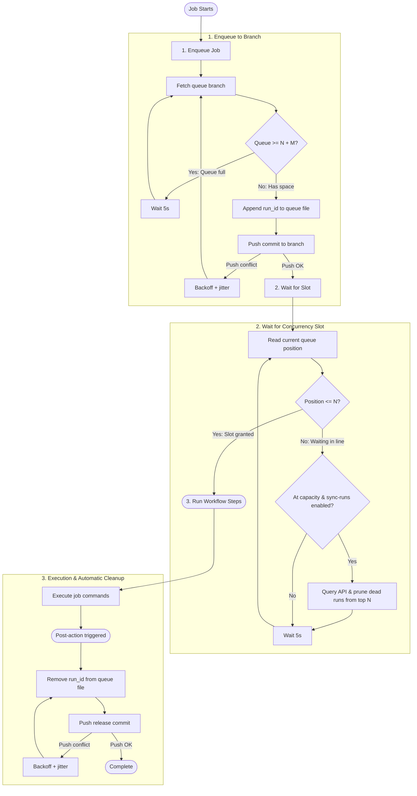
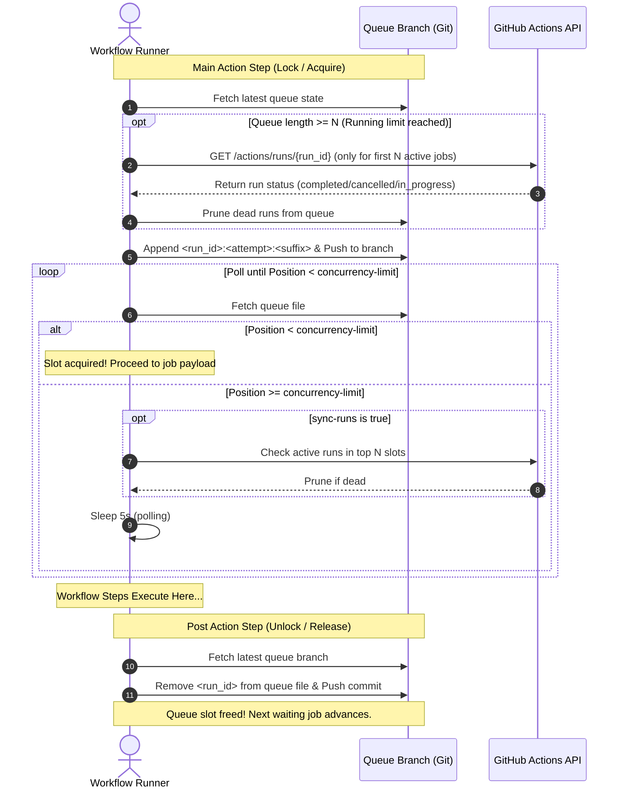

<!-- Generated by https://github.com/reakaleek/gh-action-readme -->
# <!--name-->Queue Action<!--/name-->

[](https://github.com/search?q=elastic%2Foblt-actions%2Fgithub%2Fqueue+%28path%3A.github%2Fworkflows+OR+path%3A**%2Faction.yml+OR+path%3A**%2Faction.yaml%29&type=code)
[](https://github.com/elastic/oblt-actions/actions/workflows/test-github-queue.yml)

<!--description-->
A queueing mechanism to limit concurrent job execution in GitHub Actions with run synchronization
<!--/description-->

## Inputs

<!--inputs-->
| Name                | Description                                                                                         | Required | Default                    |
|---------------------|-----------------------------------------------------------------------------------------------------|----------|----------------------------|
| `github-token`      | The token for accessing the repo and GitHub Actions API.                                            | `false`  | `${{ github.token }}`      |
| `repository`        | The repository path that stores the queue (e.g `elastic/oblt-actions`).                             | `false`  | `${{ github.repository }}` |
| `branch`            | The branch to use for the queue                                                                     | `false`  | `job-queue`                |
| `queue-file`        | The file name to store queue entries on the queue branch                                            | `false`  | `job_queue`                |
| `suffix`            | Requester id suffix to avoid identical values for parallel/matrix jobs in the same workflow run     | `false`  | `default`                  |
| `concurrency-limit` | Maximum number of jobs allowed to run concurrently                                                  | `false`  | `50`                       |
| `max-queue-size`    | Maximum number of jobs allowed to wait in the queue (0 for unlimited)                               | `false`  | `50`                       |
| `sync-runs`         | Whether to clean up orphaned queue entries from completed or cancelled workflow runs via GitHub API | `false`  | `true`                     |
| `timeout-minutes`   | Maximum time in minutes to wait for slot acquisition or release before timing out                   | `false`  | `30`                       |
<!--/inputs-->

## Outputs

<!--outputs-->
| Name | Description |
|------|-------------|
<!--/outputs-->

<!--usage action="elastic/oblt-actions/github/queue" version="env:VERSION"-->
## Getting Started

To limit concurrent executions across workflow jobs (for instance, allowing up to 50 concurrent jobs and up to 50 queued waiting jobs):

```yaml
jobs:
  heavy_job:
    runs-on: ubuntu-latest
    name: Rate-limited execution
    permissions:
      contents: write
      actions: read
    steps:
      - uses: actions/checkout@v6
      - name: Acquire queue slot
        uses: elastic/oblt-actions/github/queue@v1
        with:
          concurrency-limit: 50
          max-queue-size: 50
      - run: |
          echo "Executing inside bounded queue capacity!"
          sleep 10
```

By default, the `job-queue` branch in the current repo is used to coordinate the queue.
The action updates that branch during setup/cleanup, so jobs using `${{ github.token }}` must grant `contents: write` permissions. When `sync-runs` is enabled (default `true`), `actions: read` permission is also required to query the workflow run statuses via the GitHub API.

## Advanced Usage

### Parallel / Matrix Jobs

When running matrix jobs, set the `suffix` input so each matrix variant has a distinct queue entry:

```yaml
strategy:
  matrix:
    shard: [1, 2, 3, 4]
permissions:
  contents: write
  actions: read
steps:
  - uses: actions/checkout@v6
  - name: Acquire queue slot
    uses: elastic/oblt-actions/github/queue@v1
    with:
      suffix: shard-${{ matrix.shard }}
      concurrency-limit: 10
```

### Stale Run Synchronization

To prevent exhausting GitHub API rate limits, dead run pruning is **not** performed on every run. Pruning only triggers when the queue reaches the concurrency limit (i.e., when jobs are actually waiting in line) and only inspects the items currently occupying the running slots (the first $N$ items in the queue). If an occupied slot belongs to a workflow run that was cancelled or completed, it is evicted immediately.
<!--/usage-->

## How It Works

### Architecture & Internals

The action uses an orphan Git branch (`job-queue` by default) containing a plain-text file (`job_queue`) as a distributed FIFO queue.

1. **Structured Item Identifier**:
   Each job registers an identifier containing the GitHub Run ID:
   `<run_id>:<run_attempt>:<suffix>:<timestamp>-<random>`
   This allows any runner to identify which GitHub Actions workflow run owns each queued slot.

2. **On-Demand Dead Run Pruning (Rate-Limit Friendly)**:
   To avoid unnecessary GitHub API calls, API status checks (`GET /repos/{owner}/{repo}/actions/runs/{run_id}`) are **only performed when the concurrency limit is reached** (when jobs are blocked waiting for a slot). Furthermore, only the first $N$ running entries are checked, evicting any job whose workflow was cancelled, timed out, or aborted.

3. **Concurrency Limiting**:
   - `concurrency-limit` ($N$, default 50): If the job's 0-based position in the queue file is $< N$, the job has acquired an execution slot and continues to the workflow steps.
   - `max-queue-size` ($M$, default 50): If the queue already contains $N + M$ items (e.g. 100), incoming jobs will wait before enqueuing to prevent unbounded queue growth.

4. **Automatic Release on Job Finish**:
   In the **post-action step** (which runs automatically when the workflow job completes, whether it succeeded, failed, or was cancelled), the action checks out the queue branch, removes its identifier from the queue file, commits, and pushes with retry backoff. This immediately frees up a slot for the next waiting job.

5. **Contention Handling**:
   When multiple concurrent runners attempt to update and push to the queue branch simultaneously, Git rejects non-fast-forward pushes. The action handles this with exponential backoff and randomized jitter to avoid thundering-herd issues.

### Flowchart



### Sequence Diagram



## Developing

### Prerequisites

- [Node.js](https://nodejs.org/) (v24 or later)

### Building

```bash
npm install
npm run build
```

### Testing locally

```shell
npm run test
```
